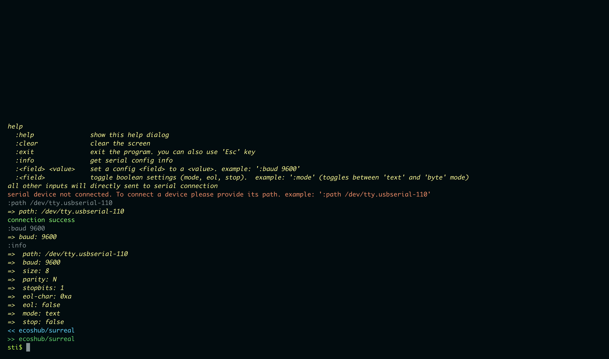
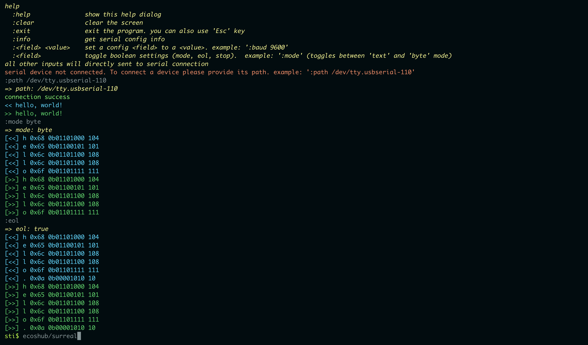

# Surreal Terminal
*Serial Terminal CLI*

**Surreal Terminal** is a command-line utility designed to provide a communication interface for **USB UART** or **RS232** serial devices. It offers essential functionality to connect, configure, and communicate with serial devices from your command line. **Surreal Terminal** offers key features such as on-the-fly communication configuration changes and data mode selection, making it a valuable tool for various applications.

## Features
- Connect to USB UART or RS232 serial devices.
- Send and receive data to/from the connected serial device.
- Configure serial configurations such as baud rate, bit size, parity, and more.
- Inspect traffic byte-by-byte. (*byte mode*)
- Use like a traditional serial terminal. (*text mode*)
- Display information about the current serial configuration.
- Enjoy colorful output for improved readability.

## How to run

To run Surreal Terminal, you can obtain the executable from the [release page](https://github.com/ecoshub/surreal/releases) and execute it. You can configure the initial settings either through command-line flags or within the program.

**Flags:**

```
  -baud int
        Baud rate. Default: 115200. Options: 115200|57600|38400|19200|9600|4800|2400|1200|600|300|200|150|134|110|75|50 (default 115200)
  -parity string
        Parity. Options: N|O|E|M|S (default "N")
  -path string
        Device path. Example: '/dev/tty.usbserial-110'
  -size int
        Data bit size. Default: 8 (default 8)
  -stop-bit int
        Stop bit. Options: 1|1.5|2. Default: 1 (default 1)
```

You can exit from program using **ESC** key, **:exit** command or good old **CTRL+C**

## How to build

build executable for current device.

    make build


Create executable for all supported operation systems and architectures. 

    make release

*supported os/arch: windows/amd64, windows/386, linux/amd64, linux/386, darwin/amd64, darwin/arm64*

Run from source code (*golang 1.2 required*)

    make run


## How to use

### Connecting



Program starts with default configurations. Default configurations:

    path: ''
    baud: 115200
    size: 8
    parity: N
    stopbits: 1
    eol-char: 0xa ('\n')
    eol: false
    mode: text
    stop: false

You can view this information by using the **:info** command.

If you haven't provided a device path using the --path flag, the program will start with no connection state and display the following message:

    serial device not connected. To connect a device please provide its path. example: ':path /dev/tty.usbserial-110'

To provide a device path, use the **:path <device_path>** command as shown above. After providing a valid device path, you'll receive a success message:

    :path /dev/tty.usbserial-110
    => path: /dev/tty.usbserial-110
    connection success

*The arrow notation **(=>)** indicates the changed value of the setting.*

You can change serial configurations like **baud** or **size** at any time, and it will change its configurations immediately.

### Communication



**Text Mode**

In text mode, any text you write in the terminal will be immediately sent to the serial device after you press enter. Sent text is displayed with a "<<" prefix, and received text is shown with a ">>" prefix:

    << hello, world!
    >> hello, world!

**Byte Mode**

You can change the output mode to byte using the :mode byte command, or simply use a blank :mode command to toggle between text mode and byte mode. Here's an example of a "Hello" message in byte mode:

    [<<] h 0x68 0b01101000 104
    [<<] e 0x65 0b01100101 101
    [<<] l 0x6c 0b01101100 108
    [<<] l 0x6c 0b01101100 108
    [<<] o 0x6f 0b01101111 111

In byte mode, each byte is displayed individually in *char*, *hex*, *bin*, and *dec* formats.

To add an end-of-line character to every text you send, enable and configure the *eol* value. Enabling *eol* adds the specified character to the end of each line. For example:

    [<<] h 0x68 0b01101000 104
    [<<] e 0x65 0b01100101 101
    [<<] l 0x6c 0b01101100 108
    [<<] l 0x6c 0b01101100 108
    [<<] o 0x6f 0b01101111 111
    [<<] . 0x0a 0b00001010 10

Now, the program is adding 0x10 (LF, '\n') to the end of each line.

You can also change the end-of-line character. For example, changing it to '\n\r' (LF CR) using the **:eol-char 0x0a0d** command:

    :eol-char 0x0a0d
    => eol-char: 0x0a0d

    [<<] h 0x68 0b01101000 104
    [<<] e 0x65 0b01100101 101
    [<<] l 0x6c 0b01101100 108
    [<<] l 0x6c 0b01101100 108
    [<<] o 0x6f 0b01101111 111
    [<<] . 0x0a 0b00001010 10
    [<<] . 0x0d 0b00001101 13

You can stop printing with the **:stop** command, which toggles between *start* and *stop*.

## Contributing
Contributions to this project are welcome. If you have any suggestions, bug reports, or feature requests, please open an issue or submit a pull request.

## License
This program is licensed under the MIT License.
